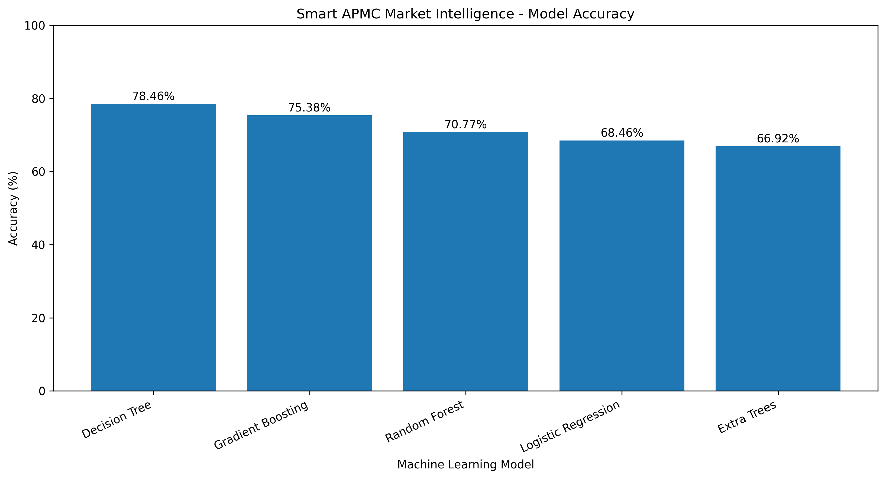

# Smart APMC Market Intelligence

## AI-Based Agricultural Produce Market Committee Analysis and Prediction System

Smart APMC Market Intelligence is a machine learning-based agricultural market analysis system designed to process and analyze Agricultural Produce Market Committee (APMC) data.

The project converts semi-structured APMC market information into a structured machine learning dataset, performs preprocessing and feature engineering, trains multiple machine learning models, evaluates their performance, generates predictions, and automatically produces analytical graphs and result files.

The system is designed as a foundation for intelligent agricultural decision-support applications such as APMC classification, market recommendation, commodity price prediction, and farmer market intelligence.

---

# Project Overview

Agricultural Produce Market Committees play an important role in agricultural trade by providing regulated marketplaces where farmers can sell agricultural commodities.

However, APMC-related datasets may contain:

- Irregular formatting
- Missing values
- Multiple tables inside the same CSV
- Regional-language text
- Main market and sub-market information
- Establishment-year information
- Market-area information

This project automatically processes such data and converts it into a machine learning-ready format.

The current implementation performs market classification based on establishment-era characteristics and associated APMC information.

---

# Project Title

**Smart APMC Market Intelligence: Machine Learning-Based Agricultural Market Analysis and Prediction System**

---

# Objective

The main objective of this project is to develop an intelligent APMC market analysis system capable of:

- Cleaning semi-structured agricultural market datasets
- Extracting main-market and sub-market information
- Performing automatic feature engineering
- Training multiple machine learning algorithms
- Comparing model performance
- Identifying the best-performing model
- Generating APMC category predictions
- Producing visual analytical reports
- Saving trained models for future deployment

---

# Dataset

The input dataset used in this project is:

```text
List_Of_APMC.csv

The dataset contains information related to Agricultural Produce Market Committees and associated sub-markets.

The original dataset contains approximately:

481 rows
13 columns

The CSV contains both primary APMC information and additional summary information.

Therefore, the preprocessing pipeline extracts the relevant APMC columns and restructures them into a cleaner machine learning dataset.

Dataset Path

The Python program uses the following directory:

C:\Users\sagni\Downloads\Smart APMC Market Intelligence

Input file:

C:\Users\sagni\Downloads\Smart APMC Market Intelligence\List_Of_APMC.csv
Data Preprocessing

The preprocessing stage performs several operations before machine learning begins.

These include:

Reading the CSV using compatible character encoding
Extracting the main APMC data block
Removing invalid rows
Removing duplicate records
Converting establishment-year values into numeric format
Cleaning missing text values
Reconstructing main-market information
Separating main markets and sub-markets
Combining market records into one dataset
Creating additional machine learning features

The processed dataset is saved as:

ais_cleaned_apmc_data.csv

or, for the CSA experiment:

csa_cleaned_apmc_data.csv
Reconstructed Dataset Structure

After preprocessing, the dataset contains fields such as:

Feature	Description
record_id	Unique record identifier
market_type	Main Market or Sub Market
market_name	Name of the market
establishment_year	Market establishment year
parent_main_market	Associated parent APMC
parent_main_year	Parent market establishment year
market_area	Market area information
market_name_length	Length of the market name
parent_name_length	Length of parent market name
area_name_length	Length of market-area text
market_era	Target category used for classification
Target Variable

The classification target used in the current implementation is:

market_era

Markets are classified into three establishment periods.

Market Era	Establishment Period
Legacy	Up to 1990
Established	1991–2005
Modern	2006 onwards

The target categories are represented as:

Legacy (<=1990)
Established (1991-2005)
Modern (2006+)
Feature Engineering

Additional features are generated from the original dataset to improve machine learning analysis.

Examples include:

market_name_length
parent_name_length
area_name_length
parent_main_year
market_type
market_area
parent_main_market

The actual establishment year is excluded from the machine learning feature matrix when it is directly used to construct the target variable.

This prevents direct target leakage.

Machine Learning Pipeline

The project uses a complete machine learning pipeline consisting of:

Raw APMC Dataset
        |
        v
Data Cleaning
        |
        v
Market Reconstruction
        |
        v
Feature Engineering
        |
        v
Categorical Encoding
        |
        v
Numeric Scaling
        |
        v
Train-Test Split
        |
        v
Multiple ML Models
        |
        v
Performance Evaluation
        |
        v
Best Model Selection
        |
        v
Prediction
        |
        v
Graphs + CSV Results
Machine Learning Algorithms

The system trains and evaluates multiple machine learning algorithms.

The current implementation includes:

Logistic Regression

Logistic Regression provides a baseline classification model and works well for linearly separable patterns.

Decision Tree

Decision Tree creates hierarchical decision rules for predicting market categories.

Random Forest

Random Forest combines multiple decision trees to improve classification stability and accuracy.

Extra Trees

Extra Trees introduces additional randomization while constructing decision trees and can improve generalization.

Gradient Boosting

Gradient Boosting sequentially builds weak learners and combines them into a stronger predictive model.

Data Preprocessing Pipeline

Numerical features are processed using:

Missing Value Imputation
        ↓
Median Replacement
        ↓
StandardScaler

Categorical features are processed using:

Missing Value Imputation
        ↓
Most Frequent Category
        ↓
OneHotEncoder

The preprocessing and machine learning model are integrated using:

Pipeline

and:

ColumnTransformer

from Scikit-learn.

Train-Test Split

The cleaned dataset is divided into:

75% Training Data
25% Testing Data

The project uses:

random_state=42

for reproducibility.

Stratified sampling is used whenever sufficient samples exist in each target class.

Model Evaluation Metrics

Each machine learning model is evaluated using four major classification metrics.

Accuracy

Accuracy measures the percentage of correctly predicted records.

Accuracy =
Correct Predictions / Total Predictions
Precision

Precision measures how many positive predictions made by the model are actually correct.

Precision =
True Positives / (True Positives + False Positives)
Recall

Recall determines how effectively the model identifies actual instances of each class.

Recall =
True Positives / (True Positives + False Negatives)
F1 Score

The F1 Score represents the harmonic mean of Precision and Recall.

F1 Score =
2 × Precision × Recall
----------------------
Precision + Recall
Model Accuracy Visualization

The following graph represents the accuracy achieved by different machine learning models used in the Smart APMC Market Intelligence system.

The accuracy graph makes it easier to compare the classification performance of the different machine learning algorithms.

The model with the highest accuracy is automatically selected as the final model.

Model Comparison

The project also generates a detailed comparison graph containing:

Accuracy
Precision
Recall
F1 Score

Generated file:

comparison_graph.png

The comparison graph provides a more complete evaluation than accuracy alone.

Correlation Heatmap

A correlation heatmap is generated to understand relationships between numerical and encoded attributes.

Generated file:

heatmap.png

The heatmap may contain features such as:

establishment_year
parent_main_year
market_name_length
parent_name_length
area_name_length
market_type_code
market_era_code

Correlation values range between:

-1 and +1

where:

+1 = Strong positive relationship

 0 = No linear relationship

-1 = Strong negative relationship
Best Model Result Graph

After comparing all machine learning algorithms, the best-performing model is selected automatically.

The system generates a graph displaying the best model's:

Accuracy
Precision
Recall
F1 Score

Generated file:

result_graph.png
Prediction Analysis

The selected model performs predictions on the testing dataset.

The prediction output contains:

Column	Description
Record_Number	Prediction record number
Actual	Actual market category
Predicted	Predicted market category
Correct_Prediction	Whether the prediction was correct
Confidence_Percent	Model confidence

The predictions are stored inside:

prediction.csv
Prediction Visualization

The project generates an Actual vs Predicted visualization.

Generated file:

prediction_graph.png

The graph compares:

Actual Class Distribution

vs

Predicted Class Distribution

This allows visual assessment of model prediction quality.

Confusion Matrix

The system generates a confusion matrix for the selected best-performing model.

Generated file:

confusion_matrix.png

The confusion matrix shows:

Actual Classes
      vs
Predicted Classes

Correct predictions appear along the diagonal of the matrix.

Misclassifications appear outside the diagonal.

Output Files

For the AIS experiment, the project can generate:

ais_cleaned_apmc_data.csv

ais_result.csv

ais_prediction.csv

ais_best_model.pkl

ais_accuracy_graph.png
ais_accuracy_graph.svg

ais_comparison_graph.png
ais_comparison_graph.svg

ais_heatmap.png
ais_heatmap.svg

ais_result_graph.png
ais_result_graph.svg

ais_prediction_graph.png
ais_prediction_graph.svg

ais_confusion_matrix.png
ais_confusion_matrix.svg

For CSA experiments, the equivalent files use the csa_ prefix.

Example:

csa_cleaned_apmc_data.csv

csa_result.csv

csa_prediction.csv

csa_best_model.pkl

csa_accuracy_graph.png

csa_comparison_graph.png

csa_heatmap.png

csa_result_graph.png

csa_prediction_graph.png

csa_confusion_matrix.png
Project Folder Structure
Smart APMC Market Intelligence/
│
├── List_Of_APMC.csv
│
├── README.md
│
├── accuracy_graph.png
│
├── ais_cleaned_apmc_data.csv
├── ais_result.csv
├── ais_prediction.csv
├── ais_best_model.pkl
│
├── ais_accuracy_graph.png
├── ais_accuracy_graph.svg
├── ais_comparison_graph.png
├── ais_comparison_graph.svg
├── ais_heatmap.png
├── ais_heatmap.svg
├── ais_result_graph.png
├── ais_result_graph.svg
├── ais_prediction_graph.png
├── ais_prediction_graph.svg
├── ais_confusion_matrix.png
├── ais_confusion_matrix.svg
│
├── csa_cleaned_apmc_data.csv
├── csa_result.csv
├── csa_prediction.csv
├── csa_best_model.pkl
│
├── csa_accuracy_graph.png
├── csa_accuracy_graph.svg
├── csa_comparison_graph.png
├── csa_comparison_graph.svg
├── csa_heatmap.png
├── csa_heatmap.svg
├── csa_result_graph.png
├── csa_result_graph.svg
├── csa_prediction_graph.png
├── csa_prediction_graph.svg
├── csa_confusion_matrix.png
└── csa_confusion_matrix.svg
Required Python Libraries

The project requires Python 3.10 or newer.

Install the required packages using:

pip install pandas numpy matplotlib scikit-learn

The main libraries used are:

Pandas
NumPy
Matplotlib
Scikit-learn
Pickle
OS
Running the Project

Open Command Prompt or Terminal.

Navigate to the project folder:

cd "C:\Users\sagni\Downloads\Smart APMC Market Intelligence"

Run the Python program:

python main.py

If your Python file has a different name, replace main.py accordingly.

For example:

python ais_model.py

or:

python csa_model.py
Expected Console Output

During execution, the program displays information such as:

================================================================================
SMART APMC MARKET INTELLIGENCE
AIS MODEL TRAINING + ANALYSIS + PREDICTION
================================================================================

Raw dataset shape: ...

Total cleaned market records: ...

Market era distribution:
Legacy ...
Established ...
Modern ...

Training records: ...
Testing records: ...

================================================================================
MODEL TRAINING
================================================================================

Training: Logistic Regression
Accuracy  : ...
Precision : ...
Recall    : ...
F1 Score  : ...

Training: Decision Tree
...

Training: Random Forest
...

Training: Extra Trees
...

Training: Gradient Boosting
...

Best Model: ...
Best Accuracy: ...%

Generated files:
...

DONE!
Saved Machine Learning Model

The best-performing machine learning pipeline is stored as:

ais_best_model.pkl

or:

csa_best_model.pkl

The pickle file contains:

Best ML Model
Preprocessing Pipeline
Label Encoder
Feature Information
Target Information
Best Model Name
Best Accuracy

This allows the model to be loaded later without retraining.

Example:

import pickle

with open("ais_best_model.pkl", "rb") as file:
    model_package = pickle.load(file)

model = model_package["model"]

print(model_package["best_model_name"])
print(model_package["best_accuracy"])
Research Architecture

The project can be represented using the following conceptual architecture:

                APMC Dataset
                     |
                     v
          +----------------------+
          |   Data Acquisition   |
          +----------------------+
                     |
                     v
          +----------------------+
          |   Data Cleaning      |
          +----------------------+
                     |
                     v
          +----------------------+
          | Market Reconstruction|
          +----------------------+
                     |
                     v
          +----------------------+
          | Feature Engineering  |
          +----------------------+
                     |
                     v
          +----------------------+
          | Feature Processing   |
          +----------------------+
                     |
                     v
     +--------------------------------+
     | Machine Learning Algorithms    |
     |                                |
     | Logistic Regression            |
     | Decision Tree                  |
     | Random Forest                  |
     | Extra Trees                    |
     | Gradient Boosting              |
     +--------------------------------+
                     |
                     v
          +----------------------+
          | Model Evaluation     |
          +----------------------+
                     |
                     v
          +----------------------+
          | Best Model Selection |
          +----------------------+
                     |
                     v
          +----------------------+
          | APMC Prediction      |
          +----------------------+
                     |
                     v
      +--------------------------------+
      | CSV + Graphs + Saved Model     |
      +--------------------------------+
AIS, CSA and PSO Extension

The project structure supports experiments using optimization techniques such as:

AIS
CSA
PSO

where:

AIS = Artificial Immune System

CSA = Crow Search Algorithm

PSO = Particle Swarm Optimization

These methods can be integrated for:

Feature selection
Hyperparameter optimization
Model optimization
Search-space exploration
Improved classification performance

A structured experiment can compare:

Base ML

vs

AIS + ML

vs

CSA + ML

vs

PSO + ML
Proposed Optimization Architecture
                      Dataset
                         |
                         v
                  Preprocessing
                         |
                         v
                 Feature Engineering
                         |
                         v
            +-------------------------+
            | Optimization Algorithm  |
            +-------------------------+
                  /       |       \
                 /        |        \
               AIS       CSA       PSO
                 \        |        /
                  \       |       /
                         v
                 Optimized Features
                         |
                         v
                Machine Learning
                         |
                         v
                  Best Classifier
                         |
                         v
                    Prediction
Experimental Comparison

The different optimization approaches can later be compared using:

Technique	Accuracy	Precision	Recall	F1 Score
AIS	Generated	Generated	Generated	Generated
CSA	Generated	Generated	Generated	Generated
PSO	Generated	Generated	Generated	Generated

This makes the system suitable for comparative machine learning research.

Applications

The proposed Smart APMC Market Intelligence framework can eventually support:

Agricultural market analytics
APMC classification
Market recommendation
Farmer decision support
Agricultural market monitoring
Commodity price analysis
Agricultural price forecasting
Market trend analysis
Market accessibility analysis
Regional agricultural intelligence
Future Scope

The current APMC dataset primarily describes market structure.

The project can be significantly expanded using historical agricultural commodity data containing:

Date

State

District

APMC

Commodity

Variety

Arrival Quantity

Minimum Price

Maximum Price

Modal Price

Using these attributes, future versions of the project can perform real commodity price forecasting.

Future Price Prediction Model

A future version can predict:

Tomorrow's Commodity Price

7-Day Average Price

30-Day Price Trend

Expected Maximum Price

Expected Minimum Price

Possible algorithms include:

Random Forest Regression
XGBoost
LightGBM
CatBoost
LSTM
GRU
Transformer
Temporal Fusion Transformer
Smart Market Recommendation

The system can also be extended to recommend the most suitable APMC to a farmer.

A possible recommendation score is:

Market Score =
w1 × Predicted Price
-
w2 × Distance
+
w3 × Price Trend
+
w4 × Market Demand
-
w5 × Price Volatility

A farmer could provide:

Crop
Quantity
Current Location
Expected Selling Date

The system could return:

Recommended APMC

Expected Commodity Price

Distance

Expected Revenue

Price Trend

Market Risk

Alternative APMC
Explainable AI

Future versions can integrate explainable AI techniques such as:

SHAP

LIME

Feature Importance

These techniques can explain why a particular APMC or prediction was selected.

For example:

Recommended Market: APMC-X

Reasons:

High predicted selling price
Strong recent market trend
Low estimated price volatility
Reasonable transport distance
High historical demand
Web Application Extension

The machine learning system can be deployed through a web dashboard using:

Streamlit

or:

Flask
FastAPI
React

A possible dashboard could include:

Home Dashboard

Dataset Statistics

APMC Search

Market Analysis

ML Model Comparison

Market Prediction

Price Forecasting

Market Recommendation

Interactive Maps

Prediction History
Proposed Technology Stack
Component	Technology
Programming Language	Python
Data Processing	Pandas
Numerical Processing	NumPy
Machine Learning	Scikit-learn
Visualization	Matplotlib
Model Storage	Pickle
Optimization	AIS / CSA / PSO
Dashboard	Streamlit
API	FastAPI
Frontend	React
Explainability	SHAP
Mapping	Folium
Advantages

The Smart APMC Market Intelligence system provides several advantages:

Automated dataset preprocessing
Handles semi-structured APMC data
Supports main and sub-market records
Uses multiple machine learning models
Automatically identifies the best-performing model
Generates publication-ready graphs
Generates prediction CSV files
Stores trained ML models
Supports optimization-based extensions
Can be extended for agricultural price forecasting
Limitations

The current input dataset primarily contains structural APMC information rather than historical commodity-price time-series data.

Therefore, the current implementation should be interpreted as:

APMC Market Classification and Intelligence

rather than:

Actual Agricultural Commodity Price Forecasting

Historical price data is required to accurately implement commodity price prediction.

Research Contribution

The project provides a reusable architecture that combines:

Semi-Structured Agricultural Data Processing

+

Feature Engineering

+

Machine Learning Classification

+

Optimization Algorithms

+

Automated Model Evaluation

+

Prediction Analysis

+

Data Visualization

The architecture can be further extended into an intelligent agricultural decision-support framework.

Proposed Research Title

Smart APMC Market Intelligence: An Optimization-Assisted Machine Learning Framework for Agricultural Market Analysis and Decision Support

An extended research title can be:

AgroMarketAI: An Explainable Optimization-Driven APMC Intelligence Framework for Agricultural Market Prediction and Farmer Decision Support

Proposed Research Question

Can optimization-assisted machine learning improve APMC market intelligence and classification compared with conventional machine learning approaches?

For future price datasets, this may be extended to:

Can an optimization-assisted APMC recommendation framework combining predicted commodity prices, market distance, historical trends and volatility improve farmer market-selection decisions?

Conclusion

Smart APMC Market Intelligence demonstrates how semi-structured agricultural market information can be transformed into a structured machine learning workflow.

The system automatically performs data preprocessing, feature engineering, classification, model evaluation, prediction generation, visualization and model storage.

By extending the system with historical commodity-price datasets and optimization techniques such as AIS, CSA and PSO, the framework can evolve into a complete intelligent agricultural market decision-support system capable of assisting farmers, researchers and agricultural-market administrators.

Visualization
Model Accuracy


Author

Smart APMC Market Intelligence Project

Machine Learning / Artificial Intelligence / Agricultural Analytics

License

This project is intended for educational, academic and research purposes.
